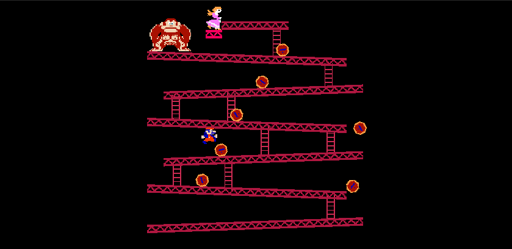

# Donkey Kong

Donkey Kong is a classic video game series developed by Nintendo, originating in the early 1980s. It stars Donkey Kong, a large, powerful gorilla, often on an adventure through lush jungles, tropical islands, and varied environments filled with challenges and enemies. The franchise began as an arcade game, where players controlled a character named Jumpman (later known as Mario) as he tried to rescue a damsel in distress from the giant ape, Donkey Kong.
